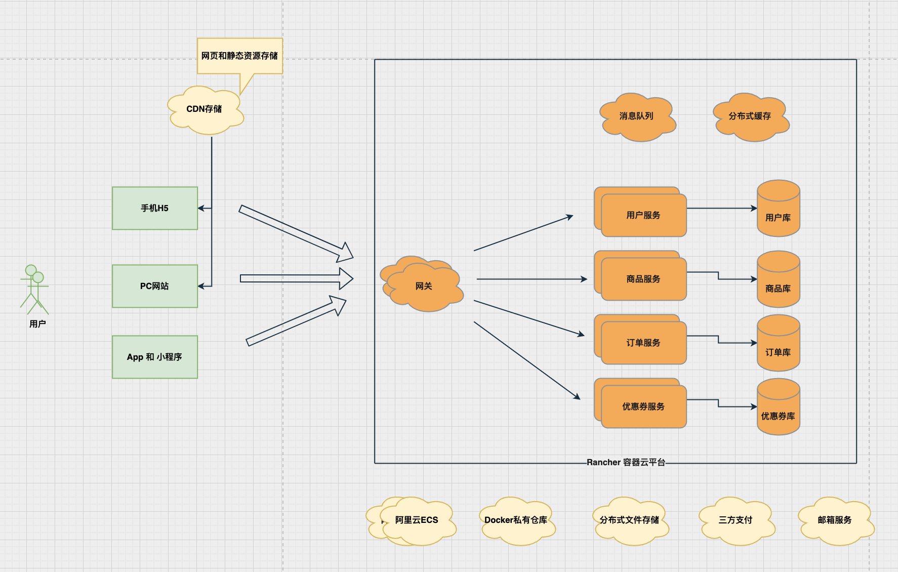

# shop

## 前言

shop 是一个 B2C 模式的简单电商项目，包含电商项目的核心功能模块，没有前端页面。

**商业模式介绍**

B 表企业，C 代表个人（或者说终端消费用户），O 代表线上，也可以代表线下。

- `B2C`：Business To Consumer 企业和个人之间的交易。例如：天猫超市、考拉海购、京东超市、小米有品。
- `B2B`：Business To Business 企业和企业之间的交易。例如：阿里巴巴1688，产品供应链的上下游。
- `C2C`：Consumer To Consumer 个人和个人之见的交易。例如：闲鱼卖二手、58同城交易、朋友圈个人微商。
- `O2O`：Online To Offline 线上购买线下体验。例如：美团上领取优惠券，到店消费。

## 项目介绍

### 需求分析和规划

* 用户服务
    * 用户注册/登录
    * 头像和信息维护
    * 收货地址模块
* 优惠券服务
    * 展示和领劵
    * 使用和释放
* 商品服务
    * 商品基本展示
    * 库存扣减回收
    * 购物车模块
* 订单服务
    * 下单支付
    * 订单基本操作

**前后端分离架构，容器编排部署**



### 数据库划分和用户表介绍

* 各个微服务独立数据库（按模块垂直分库）

  * 用户服务数据库 shop_user
  * 商品服务数据库 shop_product
  * 优惠券服务数据库 shop_coupon
  * 订单服务数据库 shop_order

#### 用户服务数据库

```mysql
DROP DATABASE IF EXISTS `shop_user`;
CREATE DATABASE `shop_user` DEFAULT CHARACTER SET utf8mb4 COLLATE utf8mb4_general_ci;
```

  * 用户表

    ```mysql
    DROP TABLE IF EXISTS `user`;
    CREATE TABLE `user` (
      `id` bigint(19) NOT NULL COMMENT '主键ID',
      `nickname` varchar(20) DEFAULT NULL COMMENT '昵称',
      `password` char(60) DEFAULT NULL COMMENT 'BCrypt加密后的密码',
      `head_img` varchar(255) DEFAULT NULL COMMENT '头像',
      `signature` varchar(255) DEFAULT NULL COMMENT '个性签名',
      `gender` tinyint(1) unsigned DEFAULT 1 COMMENT '0表示女，1表示男',
      `points` int(10) DEFAULT 0 COMMENT '积分',
      `email` varchar(255) DEFAULT NULL COMMENT '电子邮箱',
      `create_time` datetime NOT NULL COMMENT '创建时间',
      `update_time` datetime NOT NULL COMMENT '更新时间',
      PRIMARY KEY (`id`),
      UNIQUE KEY `uk_email` (`email`(16))
    ) ENGINE=InnoDB COMMENT='用户表';
    ```

  * 收货地址表

    ```mysql
    DROP TABLE IF EXISTS `address`;
    CREATE TABLE `address` (
      `id` bigint(19) NOT NULL COMMENT '主键ID',
      `user_id` bigint(19) DEFAULT NULL COMMENT '用户id',
      `default_address` tinyint(1) unsigned DEFAULT NULL COMMENT '是否默认收货地址：0->否，1->是',
      `receive_name` varchar(20) DEFAULT NULL COMMENT '收货人姓名',
      `phone` varchar(32) DEFAULT NULL COMMENT '收货人电话',
      `province` varchar(16) DEFAULT NULL COMMENT '省/直辖市',
      `city` varchar(16) DEFAULT NULL COMMENT '市',
      `district` varchar(16) DEFAULT NULL COMMENT '区',
      `detail_address` varchar(255) DEFAULT NULL COMMENT '详细地址',
      `create_time` datetime NOT NULL COMMENT '创建时间',
      `update_time` datetime NOT NULL COMMENT '更新时间',
      PRIMARY KEY (`id`)
    ) ENGINE=InnoDB COMMENT='收货地址表';
    ```

### 后端技术选型

- Spring Boot 2.6.11
- Spring Cloud 2021.0.4
- Spring Cloud Alibaba 2021.0.4.0

### 环境搭建

#### 开发工具

| 工具          | 说明                                 | 官网                                                |
| ------------- | ------------------------------------ | --------------------------------------------------- |
| IntelliJ IDEA | 领先的 Java 和 Kotlin IDE            | https://www.jetbrains.com.cn/idea/download/         |
| Typora        | Markdown 编辑器                      | https://typora.io/                                  |
| MyBatisX      | MyBatis-Plus官方代码生成插件（idea） | https://plugins.jetbrains.com/plugin/10119-mybatisx |

#### 开发环境

| 工具  | 版本号 |                             下载                             |
| :---: | :----: | :----------------------------------------------------------: |
|  JDK  |   17   | https://www.oracle.com/java/technologies/javase/jdk17-archive-downloads.html |
| MySQL |  8.0   |          https://dev.mysql.com/downloads/installer/          |

